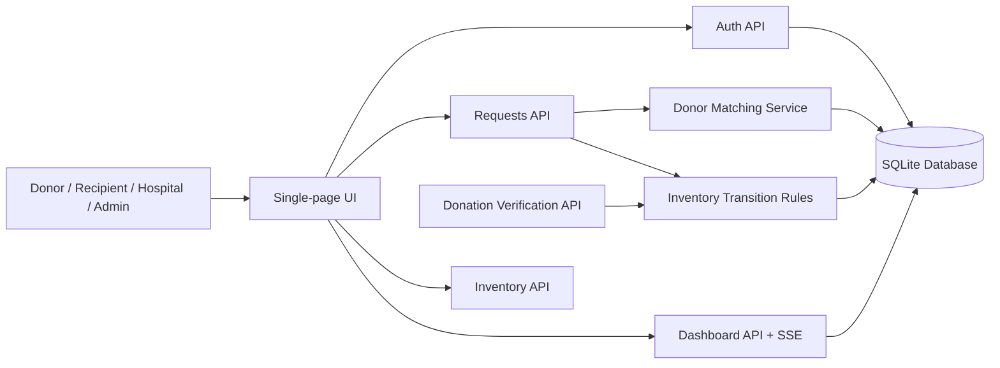
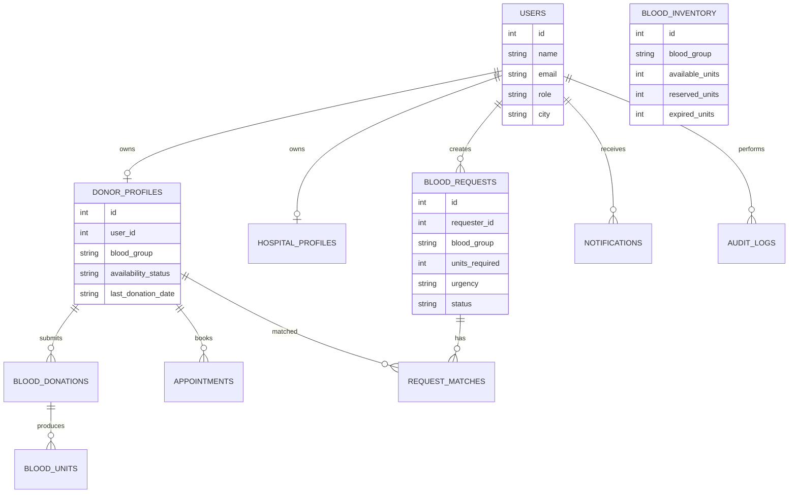

# BloodBank Architecture

BloodBank is organized as a small modular Flask application with database-backed APIs and a single-page frontend.

## Runtime Flow

## Data Model

## Service Boundaries

- `services/compatibility.py`: blood group compatibility rules.
- `services/eligibility.py`: donor age, availability, and cooldown checks.
- `services/inventory.py`: reserve, release, and fulfill inventory transitions.
- `services/matching.py`: donor ranking for new and existing requests.
- `services/analytics.py`: dashboard metrics and chart data.
- `services/notifications.py`: in-app notification creation and external-provider placeholders.

